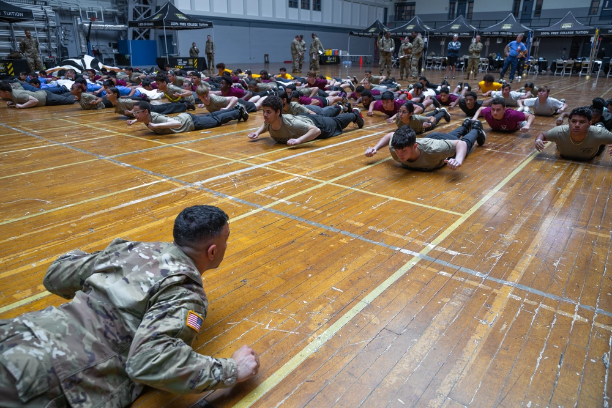

```{r}
library(tidyverse)
library(ggplot2)
```


## Learning pathway {.smaller}

::: {.fragment .semi-fade-out}

  -  From theory into practice **(1)**  
     - Learning platform
     - Cadet led warm-up sessions

:::


::: {.fragment .fade-in-then-semi-out}
 - Military pentathlon and military working demands **(2: theory)**  
       - Working demands in the military context  
       - Deployment - operations  
       - Challenges  
       - Training strategies     

:::
    
::: {.fragment .fade-in-then-semi-out}
 - Workshop **(3: discussion - reflection - practical)**  
      - Working with your working demands  
      - Test fitness vs. functional fitness  

:::

::: {.fragment .fade-in-then-semi-out}    
 - Optimizing performance **(4: theory)**    
        - Elaborate upon training methods  
        - Concurrent training
        - And more...  
:::


# The Art of Warming Up - In class

## Today Warming-up session

### From theory into practice **(1)** 

-   Short recap - Warm-up guidelines

-   Cadet presentations

-   First cadet led warm-up session outside  😀

::: fragment
-   Learning outcomes from this warm-up module:

    1\. Knowledge of injury prevention strategies for military personnel

    2\. Knowledge of the purpose of warming up prior to exercise

    3\. [*Knowledge to set up a warm-up program for a specific workout session*]{.fg style="--col: purple"}
:::

# Warm-up for Injury Prevention and Performance enhancement

## Power of warm-up

### The importance of implementing warm-up sessions

-   Equally important (to plan as the main session)

    -   effective and keep the overall training load minimal

-   Activities that contribute to the aims of the overall session

-   Usually \~10-30 min





::: {.fragment .absolute right=20 bottom=40}

- Excited for your warm-up programs!

:::


::: notes
The warm-up is just as important to plan as the main session itself. When done right, it’s effective without adding too much to the overall training load.

A good warm-up should directly support the goals of the main workout—everything in it should help prepare the body for what’s coming next.

Typically, it lasts anywhere from 10 to 30 minutes, depending on the intensity and demands of the session that follows.

You have all delivered a warm-up program that you will present afterwards, its really satisfying to see how you all have made an effort in preparing these warm-up programs using the theory from the lecture from the platform and together with your own experience...
:::

## Power of warm-up

### The frequently followed warm-up guideline

::::::: r-stack
::: fragment
```{r intensity}
#| echo: false
#| message: false
#| warning: false
#| fig-align: center
#| fig-height: 6.5
#| fig-width: 6.5


library(tidyverse)

# Simulate some data
set.seed(123)
df <- data.frame(
  x = 1:100,
  y = sort(runif(100, 0, 100))) |> 
  
  mutate(RAMP = ifelse(x == 10, "RAISE",
                       ifelse(x == 50, "Activate and Mobilize",
                              ifelse(x == 85, "Potentiation",x)))) 
  
# Create the ggplot
RAMP <- ggplot(df, aes(x = x, y = y, color = y)) +
  
  geom_line(size = 3) +
  scale_color_gradient(low = "lightblue", high = "darkblue") +
  
  labs(title = "Performance / Workout ready",
       x = "RAMP-method",
       y = "Intensity of exercise",
       color = "Y Value") +
  
  
  
  # add arrow line
  annotate(
  geom = "segment", x = 4, y = 0, xend = 95, yend = 0, 
   arrow = arrow(length = unit(2, "mm"), type="closed")) +
   annotate("text", x=50, y=3, label="Specificity", colour="#4DD091", size=5.3) +
  
  
  theme_classic() +
  theme(axis.text.x = element_blank(),
        legend.position = "none")

  

RAMP


```
:::

::: fragment
```{r intensity1}
#| echo: false
#| message: false
#| warning: false
#| fig-align: center
#| fig-height: 6.5
#| fig-width: 6.5


library(tidyverse)


# Simulate some data
set.seed(123)
df <- data.frame(
  x = 1:100,
  y = sort(runif(100, 0, 100))) |> 
  
  mutate(RAMP = ifelse(x == 10, "RAISE",
                       ifelse(x == 50, "Activate and Mobilize",
                              ifelse(x == 85, "Potentiation",x)))) 
  
# Create the ggplot
RAMP +
  annotate("text", x=10, y=37, label="Raise", colour="#4DD091", size=5.3) +
  annotate("rect", xmin = 0, xmax = 25, ymin = 10, ymax = 35,
  alpha = .2) +
  annotate("text", x=12, y=15, label="Run, technique,\n low intensity") 
  
 

  


```
:::

::: fragment
```{r intensity2}
#| echo: false
#| message: false
#| warning: false
#| fig-align: center
#| fig-height: 6.5
#| fig-width: 6.5


RAMP +
  # Raise
  annotate("text", x=10, y=37, label="Raise", colour="#4DD091", size=5.3) +
  annotate("rect", xmin = 0, xmax = 25, ymin = 10, ymax = 35,
  alpha = .2) +
  annotate("text", x=12, y=15, label="Run, technique,\n low intensity") +
  
  # Activate
  annotate("text", x=50, y=68, label="Activate and Mobilize", colour="#4DD091", size=5.3) +
  annotate("rect", xmin = 30, xmax = 65, ymin = 35, ymax = 65,
  alpha = .2)+
  annotate("text", x=48, y=40, label="Muscle-\n specific activation") 
  
  
  
  
```
:::

::: fragment
```{r intensity3}
#| echo: false
#| message: false
#| warning: false
#| fig-align: center
#| fig-height: 6.5
#| fig-width: 6.5


RAMP +
# Raise
  annotate("text", x=10, y=37, label="Raise", colour="#4DD091", size=5.3) +
  annotate("rect", xmin = 0, xmax = 25, ymin = 10, ymax = 35,
  alpha = .2) +
  annotate("text", x=12, y=15, label="Run, technique,\n low intensity") +
  
  # Activate
  annotate("text", x=50, y=68, label="Activate and Mobilize", colour="#4DD091", size=5.3) +
  annotate("rect", xmin = 30, xmax = 65, ymin = 35, ymax = 65,
  alpha = .2)+
  annotate("text", x=48, y=40, label="Muscle-\n specific activation") +
  
  # Potentiate
  annotate("text", x=87, y=100, label="Potentiation", colour="#4DD091", size=5.3) +
  annotate("rect", xmin = 75, xmax = 100, ymin = 65, ymax = 98,
  alpha = .2) +
  annotate("text", x=88, y=76, label="Sport-\n specific exercises") 
  

```
:::
:::::::

::: {.absolute bottom="-35" left="-40" style="font-size: 45%;"}
[Figure created with<br> inspiration from @jeffreys_2007]
:::

::: notes
One effective way to structure a warm-up is by using the RAMP method. It’s a simple and practical framework that helps guide the design of warm-ups for both training and competition.

RAMP stands for: Raise, Activate, Mobilize, and Potentiate.

-   Raise is the first step. The goal here is to increase body temperature, heart rate, breathing rate, blood flow, and joint mobility. This is usually done with low-intensity activities—like light jogging, cycling, or dynamic movement—just enough to get the system going.

-   Next comes Activate and Mobilize. This step focuses on turning on the key muscle groups you’ll be using, and getting the body moving through the patterns needed for your specific activity. So if you're training for something like an obstacle course or grenade throwing, the warm-up should include movements that mimic those tasks. This part is all about specificity.

-   The last part is Potentiation, and that’s where we ramp things up. The idea is to gradually increase the intensity so your body is fully ready for high-performance efforts.

For a sprint workout, that might mean sprint drills followed by short sprints at increasing speeds.

For strength training, it could involve explosive movements—like plyometrics or gradually heavier lifts—to wake up the nervous system and get the muscles firing.

-   Now, there’s a balance here: you want to raise your baseline oxygen consumption and get those performance systems going—but if the warm-up is too intense or the recovery time too short, it can actually reduce performance. That’s because high-energy phosphate stores might get depleted, and you could end up with a build-up of fatigue products like lactate or hydrogen ions.

-   So in general, a good warm-up lasts about 10 to 30 minutes, starts at lower intensity and builds up to 70-90% of your max heart rate. It should finish with high-intensity, sport-specific movements—like sprints—to trigger that PAP effect, or post-activation potentiation, and get you primed for action.

------------------------------------------------------------------------

One way of structuring an effective warm-up protocol is to follow the RAMP-method. The RAMP framewok approach provides a framework around which to construct effective warm-up procedures for both competition and the workout

-   RAISE: Aims to elevate body temperature, heart rate, respiration rate, blood flow, and joint viscosity via low-intensity activities

-   Activate and mobilize: involves a series of specific dynamic key movement patterns involved in sports, toghether with a focus of key muscles that need to be activated to produce these movements (specificity to you sport or performance like obstacle course or throwing grenades..)

-   Potentiation: aims to increase activity to **maximal intensity** and potentiate PAP

    -   The aim of this part is to gradually shift towards the actual sport performance or workout itself.

    -   and will involve sport specific activities of increasing intensity...

    -   A sprint workout will comprose of sprint drills and sprints of increasing intensity or

    -   reistance training workout, will involve acitivites such as plyometric, and progressive and explosive resistance exercises to provide a progression towards the workout itself.

-   Trade off between to high intensity (to increase baseline VO2), to intense warm up and short recovery period.

-   Performance may be impaired due to decrease in high-energy phosphate stores and accumulation of H+/lactate...

-   In general the warm-up should be between 10-20 min, progressive in intensity (50-90% HRmax with the aim to increase body temperature and prepare for specific tasks of the sport, and end with tasks of maximum intensity such as sprints (90%) to induce the PAP effect.
:::

## You are our future leaders with PHYSICAL TRAINING COMPETANCE

-   [Education of military leaders is essential!]{.fg style="--col: purple"}

-   Key training principles:

    -   Knowledge of training load and intensity planing (i.e. total training load)
    -   Progression of training load and volume
    -   Variation - methodology
<br>
<br>
[Your knowledge]{.fg style="--col: purple"} of risk factors and training will contribute to reduce injury prevalence in the military!

::: notes
-   Total training load is a key factor for the soldier to adjust related to your training status, school activities, balance between load and restitution,

-   Progression is also something to implement to reduce the risk of injuries, especcialy when you are responsible for recruits. Recturit are more vulnerble for getting overjuse injuries with to fast progression...

-   Variation in methodology, training variation, reduce monotony and overuse injuries, adaptations...

- Knowing risk factors and education of training in the military has shown to reduce injury prevalence of 35%

:::

# Presentations Academies


| Academy     | Exercise | Day of warm-up (practice)    |
|:------------|:---------|------------:|
| Bulgaria    | Obstacle course | Later today |
| Greece      | Grenade throw  |  Sunday |
| Slovakia    | Obstacle swimming | Wedensday |
| Romania     | Obstacle course | Wedensday |

: Warm-up programs {.striped .hover}


## References
