```{r}
library(tidyverse)
library(ggplot2)
```

## Flipped classrom approach {visibility="hidden"}

1- 10-15 min digital lecture + assignment\
2- in class - key points + group discussions related to injury
prevention strategies\
3- out class - example session made by and for the cadets

# Welcome to this learning module {.smaller}

-   Who I am?
- Learning outcomes from this module:   
    1\. Knowledge of the purpose of warming up prior to exercise (both for injury prevention and performance, and some main mechanisms that is occurring)  
    2\. Knowledge to set up a warm-up program for a specific exercise  
      
-   Our expectations to you  
    - Take the digital lecture
    - Spend some time on the working material handed out on the platform and prepare the assignment together as a team (nation wise)

-   How is the working module organized to enhance learning
    - From the virtual to the residential part
    
    
    
::: {.notes}

- Working as an associate professor at the Norwegian Defence Cyber Academy, one of the organizers


- The module about warming up is organized with the purpose of activating you as a learner. This means that you will more active in your own learning process, through the brief digital lectures and using the knowledge from the lecture together with the literature handed out you will develop a warm up program that you as a nation will execute on the other participating nations.

- At the residential stay you will present this program for the other participating nations before you will execute the program at the allocated time you will receive.

:::

## How do you avoid getting injured during service? [during residental stay]

Start the lecture with a question or case.

-   What is your strategy(ies) to prevent getting injured while in the
    military service?

    -   Use two minutes to discuss with your fellow cadet

## Overview of lecture

1\. Acute vs. overuse injuries\
2. Which strategies do we have?\
3. Warm-up as a strategy\
4. Warm-up mechanisms\
5. Warm-up in sport to prevent injuries\
6. For the throwing athlete / soldier\
7. Warm up to improve performance\
8. Take home and assignment\
- Your school-team will execute this warm-up program during the
residential stay

::: notes
:::

# Injuries in Military personel

## Injuries in Military personel

### Training-related injuries

:::{.fragment .semi-fade-out}

-   Injuries results in five to 22 times more days of limited duty than illnesses [@knapik_2004]
:::

::: {.fragment .fade-in-then-semi-out}
-  In 2019, 55% of active duty soldiers in the US army reported an injury (Musculoskeletal system)
:::

::: {.fragment .fade-in-then-semi-out}
 - 72% of these were considered to be overuse injuries [@vahi_2023]
:::


::: {.fragment .fade-in-then-semi-out}
-   Physical training is a primary cause and risk factor for musculoskeletal injuries [@wardle_2017]
    -   Recruits more vulnerable for injuries
    
:::


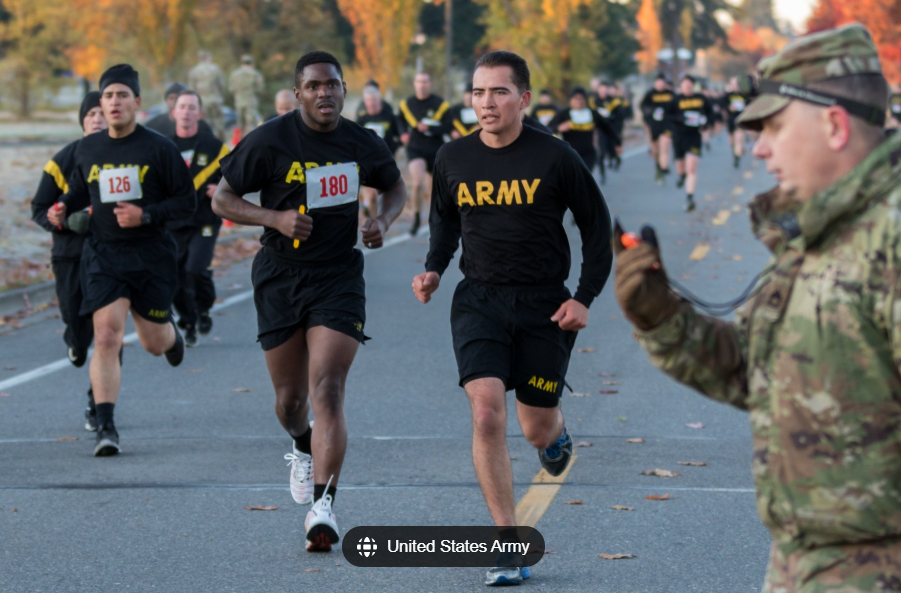{.absolute bottom=-5 right=-170 height="230"}

::: notes
-   yet developing and maintaining physical capability is a critical
    aspect of military training and employment

-   acquiring and maintaining a high level of physical fitness
    (endurance, strength), is necessary for successful perofrmance of
    military-specific tasks during training and operations

-   mitigation strategies for MSKI therefore include, but are not
    limited to, optimising PT and injury prevention

-   but first, let us look into what is an injury
:::

## Definition of injuries {.smaller}

:::: panel-tabset
### Acute injuries

-   An acute injury is a sudden injury that occurs at a specific,
    identifiable moment, usually with a clear and defined cause

-   It results directly from tissue damage when the affected tissue is
    unable to withstand the load or force applied to it

::: {#injury layout-ncol="2"}
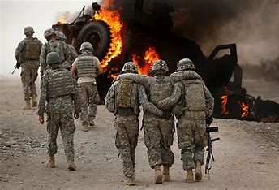

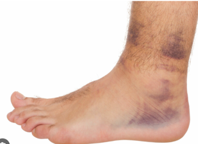
:::

### Overuse injuries
::: {.r-stack}

::: {.fragment fragment-index=1}
```{r injury}
#| echo: false
#| fig-width: 6.5
#| fig-height: 6.0

# Create a data frame with some points
data <- data.frame(
  x = c(-4, -3, -2, -1.5, -1, 0, 1, 2, 3, 4, 5),
  y = c(-6, -3.5, -4, -1, -2, 8, 4, 5, 3, 2, -4),
  yy = c(-6, -3.5, -4, -1, -2, 8, 4, 5, 3, 2, -4)
)

# Create a basic coordinate system and plot the points
injuryplot <- ggplot(data, aes(x = x, y = y)) + 
  geom_point(size = 3, color = "blue") +  # Plot points
  geom_line() +
    scale_y_continuous(
    # Features of the first axis
    name = "Tissue damage",
    # Add a second axis and specify its features
    sec.axis = sec_axis(trans=~.*10, name="Pain perception")
  ) +
   
  geom_vline(xintercept=0,
                linetype=4, colour="red")+
  geom_hline(yintercept=0,
                linetype=4, colour="red") +
  


  
  labs(title = "Overuse injury",
       x = "Time (weeks/months)",
       y = "Tissue damage") +  # Add labels
  theme_classic() + # Use a minimal theme
theme(axis.text.x = element_blank(),
      axis.text.y = element_blank(),
      #axis.title.x = element_text(size=4),
      plot.title = element_blank())

   injuryplot

```
:::


::: {.fragment fragment-index=2}
```{r injury11}
#| echo: false
#| fig-width: 6.5
#| fig-height: 6.0

injuryplot + 
  
  annotate("text", x=-2.5, y=-6, label= "Period with overuse") +
  annotate("text", x=-2.5, y=-0.5, label= "Periods with failed\n tissue adaptations") +
  
  
    geom_curve(aes(x = -4, y = -0.8, xend = -2, yend = -1),
    arrow = arrow(length = unit(0.3, "cm"), type = "closed"),
    color = "blue",
    size = 1.2,
    curvature = 0.3) +
  
   geom_curve(aes(x = -4, y = -0.8, xend = -3, yend = -3),
    arrow = arrow(length = unit(0.3, "cm"), type = "closed"),
    color = "blue",
    size = 1.2,
    curvature = 0.3) +

  
  labs(title = "Overuse injury",
       x = "Time (weeks/months)",
       y = "Tissue damage") +  # Add labels
  theme_classic() + # Use a minimal theme
theme(axis.text.x = element_blank(),
      axis.text.y = element_blank(),
      #axis.title.x = element_text(size=4),
      plot.title = element_blank())


```
:::


::: {.fragment fragment-index=3}
```{r injury2}
#| echo: false
#| fig-width: 6.5
#| fig-height: 6.0

injuryplot + 
  
   annotate("text", x=2.5, y=8.5, label= "Time of experienced injury\n Loss of duty time") +
  
    geom_curve(aes(x = 2.5, y = 7.8, xend = 0.3, yend = 8),
    arrow = arrow(length = unit(0.3, "cm"), type = "closed"),
    color = "blue",
    size = 1.2,
    curvature = -0.3) +
  
    annotate("text", x=-3.0, y=5.4, label= "Increased perception\n of pain") +
  
    geom_curve(aes(x = -3.0, y = 5.0, xend = -0.8, yend =2.2),
    arrow = arrow(length = unit(0.3, "cm"), type = "closed"),
    color = "blue",
    size = 1.2,
    curvature = 0.3) +
  
    labs(title = "Overuse injury",
       x = "Time (weeks/months)",
       y = "Tissue damage") +  # Add labels
  theme_classic() + # Use a minimal theme
theme(axis.text.x = element_blank(),
      axis.text.y = element_blank(),
      #axis.title.x = element_text(size=4),
      plot.title = element_blank())
  
  
  
```
:::

::: {.fragment fragment-index=4}
```{r injury3}
#| echo: false
#| fig-width: 6.5
#| fig-height: 6.0

injuryplot + 
  
   annotate("text", x=2.5, y=8.5, label= "Time of experienced injury\n Loss of duty time") +
  
    geom_curve(aes(x = 2.5, y = 7.8, xend = 0.3, yend = 8),
    arrow = arrow(length = unit(0.3, "cm"), type = "closed"),
    color = "blue",
    size = 1.2,
    curvature = -0.3) +
  
      annotate("text", x=-3.0, y=5.4, label= "Increased perception\n of pain") +
  
    geom_curve(aes(x = -3.0, y = 5.0, xend = -0.8, yend =2.2),
    arrow = arrow(length = unit(0.3, "cm"), type = "closed"),
    color = "blue",
    size = 1.2,
    curvature = 0.3) +
  
    annotate("text", x=3.2, y=7., label= "RTP / Return to duty attempt") +
    geom_curve(aes(x = 2.8, y = 6.8, xend = 2.3, yend =5),
    arrow = arrow(length = unit(0.3, "cm"), type = "closed"),
    color = "blue",
    size = 1.2,
    curvature = -0.3) +
  
  
    labs(title = "Overuse injury",
       x = "Time (weeks/months)",
       y = "Tissue damage") +  # Add labels
  theme_classic() + # Use a minimal theme
theme(axis.text.x = element_blank(),
      axis.text.y = element_blank(),
      #axis.title.x = element_text(size=4),
      plot.title = element_blank())
  
  
  
```
:::

::: {.fragment fragment-index=5}

```{r injury4}
#| echo: false
#| fig-width: 6.5
#| fig-height: 6.0

injuryplot + 
  
   annotate("text", x=2.5, y=8.5, label= "Time of experienced injury\n Loss of duty time") +
  
    geom_curve(aes(x = 2.5, y = 7.8, xend = 0.3, yend = 8),
    arrow = arrow(length = unit(0.3, "cm"), type = "closed"),
    color = "blue",
    size = 1.2,
    curvature = -0.3) +
  
      annotate("text", x=-3.0, y=5.4, label= "Increased perception\n of pain") +
  
    geom_curve(aes(x = -3.0, y = 5.0, xend = -0.8, yend =2.2),
    arrow = arrow(length = unit(0.3, "cm"), type = "closed"),
    color = "blue",
    size = 1.2,
    curvature = 0.3) +
  
    annotate("text", x=3.2, y=7., label= "RTP / Return to duty attempt") +
    geom_curve(aes(x = 2.8, y = 6.8, xend = 2.3, yend =5),
    arrow = arrow(length = unit(0.3, "cm"), type = "closed"),
    color = "blue",
    size = 1.2,
    curvature = -0.3) +
  
      annotate("text", x=2.8, y=-2.0, label= "RTP / Return to duty") +
    geom_curve(aes(x = 2.8, y = -2.8, xend = 4.8, yend =-4.2),
    arrow = arrow(length = unit(0.3, "cm"), type = "closed"),
    color = "blue",
    size = 1.2,
    curvature = 0.3) +
  
  
    labs(title = "Overuse injury",
       x = "Time (weeks/months)",
       y = "Tissue damage") +  # Add labels
  theme_classic() + # Use a minimal theme
theme(axis.text.x = element_blank(),
      axis.text.y = element_blank(),
      #axis.title.x = element_text(size=4),
      plot.title = element_blank())
  
  
  
```
:::


:::

::::


::: fragment
["Too much, too soon, and with too little rest"]{.bg
style="--col: pink"}
:::

::: notes
overuse injures are the most prevelent cause of all sports related
injuries also in the military context

Injuries that is gradually developing as a consequence of overuse over
time Related to duration, intensity and frequency of training And the
training load is greater than tissues ability to adapt over time

It is often related to monotonomy loading pattern, or repetitive
movements like throwing in sports or military force
:::

## Armed forces injury prevention {visibility="hidden"}

### Startegies to prevent injuries in military personel

1\. Education of military leaders

2\. Prevent overtraining (training planing)\
- individualized training program - train smarter? reduce training
volume while maintaining physical fitness and reduce injury rates

3\. Warm-up strategies

4\.

{.absolute bottom="0" right="-50" height="250"}

[@wardle_2017]

## Injury prevetion strategies for military personel

::: r-stack

```{r strat0}
#| out-width: 100%
#| 
# Load necessary libraries
library(magick)

# Read the image
tabrec <- image_read("images/table-rec.png")


tabrec

```

::: {.fragment fragment-index="1"}
```{r strat1}
#| out-width: 100%


# Load necessary libraries
library(magick)

# Read the image
tabrec <- image_read("images/table-rec.png")

# Define the coordinates and radius for the circles
circles <- data.frame(
  x = c(100),  # x-coordinates of the centers
  y = c(180),  # y-coordinates of the centers
  r = c(55)      # radii of the circles
)

# Draw circles on the image
for (i in 1:nrow(circles)) {
  tabrec <- image_draw(tabrec)
  symbols(circles$x[i], circles$y[i], circles$r[i], inches = FALSE, add = TRUE, fg = "red")
  dev.off()
}

# Display the image

tabrec

```
:::

::: {.fragment fragment-index="2"}
```{r strat2}
#| out-width: 100%

circles2 <- data.frame(
  x = c(100, 100),  # x-coordinates of the centers
  y = c(180, 300),  # y-coordinates of the centers
  r = c(55, 55)      # radii of the circles
)

# Draw circles on the image
for (i in 1:nrow(circles2)) {
  tabrec <- image_draw(tabrec)
  symbols(circles2$x[i], circles2$y[i], circles2$r[i], inches = FALSE, add = TRUE, fg = "red")
  dev.off()
}

# Display the image
tabrec


```
:::

::: {.fragment fragment-index="3"}
```{r strat3}
#| out-width: 100%

circles3 <- data.frame(
  x = c(100, 100, 100),  # x-coordinates of the centers
  y = c(180, 300, 420),  # y-coordinates of the centers
  r = c(55, 55, 55)      # radii of the circles
)

# Draw circles on the image
for (i in 1:nrow(circles3)) {
  tabrec <- image_draw(tabrec)
  symbols(circles3$x[i], circles3$y[i], circles3$r[i], inches = FALSE, add = TRUE, fg = "red")
  dev.off()
}

# Display the image
tabrec


```
:::

::: {.fragment fragment-index="4"}
```{r strat4}
#| out-width: 100%

circles4 <- data.frame(
  x = c( 102),  # x-coordinates of the centers
  y = c( 235),  # y-coordinates of the centers
  r = c( 45)           # radii of the circles
)

# Draw circles on the image
for (i in 1:nrow(circles4)) {
  tabrec <- image_draw(tabrec)
  symbols(circles4$x[i], circles4$y[i], circles4$r[i], inches = FALSE, add = TRUE, fg = "blue")
  dev.off()
}

# Display the image
tabrec


```
:::


:::

Table from @wardle_2017 review

::: notes

- So is there strategies that are recommended to implement in the military to reduce risk of injury...

In this review from 2017, the authors included 61 studies for qualitative synthesis and found good evidence for some strategies that most likely
    prevent injuries, which is marked in green (recommended)..

-   knowledge of physical fitness, supervision of injury prevention
    strategies are important for prevention for injury

-   important for making an appropriate training plan that accounts for
    soldiers multifactorial stress components, that may lead to
    overtraining and risk for muscloskeletal injuries.

-   reducing physical training volume in the **initial** military
    training may benefit the soldier. A progressive load on soldiers
    body, may reduce development of overuse injuries.

    -   during initial military training soldiers experience 25-50% of
        physical training-related injuries. That can be seen in
        conjuction with excessive training relative to initial fitness
        level

-   including education was included as a primary component of an injury
    prevention program, injuries was reduced with 30%. Telling us that
    knowledge of what can expose soldiers for increased risk of injury
    and how to circumvent that is an essential element for military commandors
    
    
- In this review conditioning did not show robust evidence as an injury prevention (maybe a little surprising) as there was mixed conclusions across studies. Although, importantly, there was not observed any negative effects of conditioning programs on injury prevalence. 
- This is partly due to low number of relevant and available military studies.

- For. example: several reviews of the literature repeat the common theme that standardized running programs that begin with low mileage and intensity, and gradually progress distance and speed, allow the body to gradually adapt to increasing stressors \[Bulloc 2010\].

So, to acoind getting injured we know that warm-up can be a strategy to reduce getting injured... 

:::


# Mechanisms of Warm-up

## Mechanisms of Warm-up

```{r intro, message=FALSE, echo=FALSE, warning=FALSE}

# Load necessary libraries
library(magick)
library(ggplot2)

# Read the image
image <- image_read("images/frontimage.jpg")

# Create an arrow annotation
arrow <- image_draw(image)
arrows(x0 = 570, 
       x1 = 750,
       y0 = 450, 
       y1 =450, 
       length = 0.25, lwd=7, angle = 30, code = 1, col="pink")
arrows(x0 = 540, 
       x1 = 750,
       y0 = 200, 
       y1 =450, 
       length = 0.25, lwd=7, angle = 30, code = 1, col="pink")
arrows(x0 = 510, 
       x1 = 750,
       y0 = 550, 
       y1 = 450, 
       length = 0.25, lwd=7, angle = 30, code = 1, col="pink")
dev.off()


arrow

# Save the annotated image
#image_write(image_with_text, path = "images/CISK_arr.png")

```


::: {.notes}

- 

:::


## Mechanisms of Warm-up

:::::::: r-stack
::: fragment
```{r 1}
#| out-width: 100%

wup <- image_annotate(arrow, "Possible warm-up mechanisms", size = 30, color = "pink", location = "+750+400") 

wup

```
:::

::: fragment
```{r 2}
#| out-width: 100%

 wup |> 
  image_annotate("Muscle temperature", size = 30, color = "white", location = "+550+450") 

```
:::

::: fragment
```{r 3}
#| out-width: 100%

 wup |>
  image_annotate("Muscle temperature", size = 30, color = "white", location = "+550+450") |> 
  image_annotate("Oxygen kinetics", size = 30, color = "white", location = "+550+120") 

```
:::

::: fragment
```{r 4}
#| out-width: 100%

 wup |>
  image_annotate("Muscle temperature", size = 30, color = "white", location = "+550+450") |> 
  image_annotate("Oxygen kinetics", size = 30, color = "white", location = "+550+120") |> 
  image_annotate("Muscle contractile performance", size = 30, color = "white", location = "+550+550")


```
:::

::: fragment
```{r 5}
#| out-width: 100%

 wup |>
  image_annotate("Muscle temperature", size = 30, color = "white", location = "+550+450") |> 
  image_annotate("Oxygen kinetics", size = 30, color = "white", location = "+550+120") |> 
  image_annotate("Muscle contractile performance", size = 30, color = "white", location = "+550+550") |> 
  image_annotate("ATP turn over rate", size = 30, color = "white", location = "+250+500") 


```
:::
::::::::

[@mcgowan_2015]

::: notes
1.  Main event of warm-up is the increase in body and muscle
    temperature, wherein higher temperature facilitaate work more
    effectively through a greater muscle metabolism (by greater turnover
    rate of energy packages in the muscle).

2.  With a greater muscle temperature an increase in power output is
    observed through as the rate of force development increases due to
    an optimized cross-bridge cycling rate.

3.  O2-kinetics: warm-up can prime the body to an elevated oxygen uptake and aerobic metabolisms can contribute to spare finite anaerobic stores during the initial stages of an exercise bout, thus preserving this energy for subsequent use.

-   Theory: an increase in muscle temperature of $\text{1 }^{\circ}\text{C}$ can enhance subsequent exercise performance by 2-5% [@racinais_2010].

In zochowski 2007 - Enhanced performance has been associated with
vasodilation of muscle blood vessels and the associated rightward short
og hte oxyhemoglobin-dissociation curve after warm-up. 
- Hemoglobin gives up almost twice as much oxygen at $\text{41 }^{\circ}\text{C}$ as at $\text{36 }^{\circ}\text{C}$, and oxygen dissociates twice as rapidly. 
- Improves central-nervous-system function (p 202) 
- Warm-up can allow subsequent tasks to begin with an elevated baseline $\text{VO}_{2}$. Resulting in less of the initial work is completed anaerobically.
:::

# Warm-up for Injury Prevention


## Power of warm-up

### Why warm-up? Planing the warm-up

- Equally important (to plan as the main session)
  - effective and keep the overall training load minimal

- Activities that contribute to the aims of the overall session

- Usually ~10-30 min 


::: {.notes}

- not in particular longer, especial for power sports to reduce fatigue and use of energy stores...

:::


## Power of warm-up

### Are there any guidelines to use in the literature?


```{r intensity}
#| echo: false
#| message: false
#| warning: false
#| fig-align: center
#| fig-height: 7.5
#| fig-width: 6.5


library(tidyverse)

# Simulate some data
set.seed(123)
df <- data.frame(
  x = 1:100,
  y = sort(runif(100, 0, 100))) |> 
  
  mutate(RAMP = ifelse(x == 10, "RAISE",
                       ifelse(x == 50, "Activate and Mobilize",
                              ifelse(x == 85, "Potentiation",x)))) 
  
# Create the ggplot
ggplot(df, aes(x = x, y = y, color = y)) +
  
  geom_line(size = 3) +
  scale_color_gradient(low = "lightblue", high = "darkblue") +
  
  labs(title = "Performance / Workout ready",
       x = "RAMP-method",
       y = "Intensity of exercise",
       color = "Y Value") +
  
  # Raise
  annotate("text", x=10, y=37, label="Raise", colour="purple", size=5.3) +
  annotate("rect", xmin = 0, xmax = 25, ymin = 10, ymax = 35,
  alpha = .2) +
  annotate("text", x=12, y=15, label="Run, technique,\n low intensity") +
  
  
  annotate("text", x=50, y=68, label="Activate and Mobilize", colour="purple", size=5.3) +
  annotate("rect", xmin = 30, xmax = 65, ymin = 35, ymax = 65,
  alpha = .2)+
  annotate("text", x=48, y=40, label="Muscle-\n specific activation") +
  
  
  annotate("text", x=87, y=102, label="Potentiation", colour="purple", size=5.3) +
  annotate("rect", xmin = 75, xmax = 100, ymin = 65, ymax = 100,
  alpha = .2) +
  annotate("text", x=88, y=76, label="Sport-\n specific exercises") +
  
  
  # add arrow line
  annotate(
  geom = "segment", x = 4, y = 0, xend = 95, yend = 0, 
   arrow = arrow(length = unit(2, "mm"), type="closed")) +
   annotate("text", x=50, y=3, label="Specificity", colour="purple", size=5.3) +
  
  
  theme_classic() +
  theme(axis.text.x = element_blank(),
        legend.position = "none")

  


```


::: {.absolute bottom=-25 left=0 style="font-size: 50%;"}
[Figure created with inspiration from @jeffreys_2007]
:::

::: {.notes}

RAMP - method

- Raise - general warm up

- Activate and mobilize

- Potentiation


One way of structuring an effective warm-up protocol is to follow the RAMP-method. The RAMP framewok approach provides a framework around which to construct effective warm-up procedures for both competition and the workout

- RAISE: Aims to elevate body temperature, heart rate, respiration rate, blood flow, and joint viscosity via low-intensity activities

- Activate and mobilize: involves a series of specific dynamic key movement patterns involved in sports, toghether with a focus of key muscles that need to be activated to produce these movements (specificity to you sport or performance like obstacle course or throwing grenades..)


- Potentiation: aims to increase activity to **maximal intensity** and potentiate PAP
  - The aim of this part is to gradually shift towards the actual sport performance or workout itself.
  - and will involve sport specific activities of increasing intensity...

  - A sprint workout will comprose of sprint drills and sprints of increasing intensity or
  - reistance training workout, will involve acitivites such as plyometric, and progressive and explosive resistance exercises to provide a progression towards the workout itself.


- Trade off between to high intensity (to increase baseline VO2), to intense warm up and short recovery period. 
- Performance may be impaired due to decrease in high-energy phosphate stores and accumulation of H+/lactate... 


- In general the warm-up should be between 10-20 min, progressive in intensity (50-90% HRmax with the aim to increase body temperature and prepare for specific tasks of the sport, and end with tasks of maximum intensity such as sprints (90%) to induce the PAP effect.

:::


## Armed forces injury prevention

### Warm-up strategies

:::: {.columns}

::: {.column width="50%"}


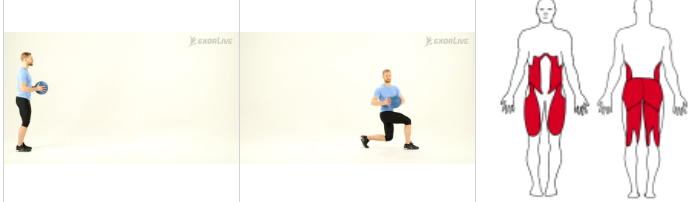
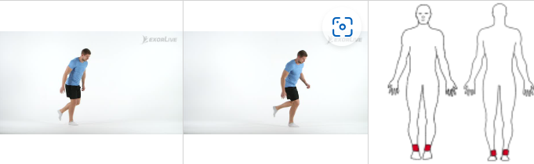
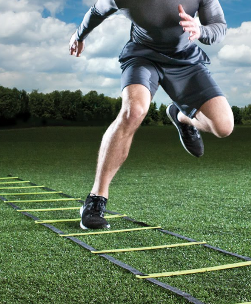{.absolute bottom=0 left=0 width="170" height="150"}
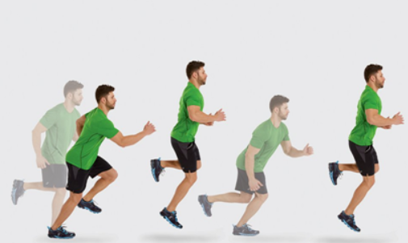{.absolute bottom=0 left=230 width="170" height="165"}

:::

::: {.column width="50%"}
-   Dynamic warm up should include agility, plyometrics, power, core and
    balance

-   These components enhance muscle flexibility, joint mobility, and
    neuromuscular activation, which is essential for optimal injury
    prevention

:::

::::

::: {.absolute bottom=-35 left=0 style="font-size: 50%;"}
[@soligard_2008; @kirkendall_2010]
:::

::: notes
-   Has a substantial impact of the readiness of the force

-   Due to the amount of limited duty time they cause
:::

## Implementation of warm-up i sports {.smaller}

### Movements

-   Rapid movement exercises

-   Six different sets of exercise (fotbal)\
    1 slow runing with moveemnts\
    2 strength - plyometrics and balance (10 min)\
    3 speed running specific to football (sudden changes/direction)

Outcome:

Lower risk of injuries overall, overuse injures and severe injuries in
the intervention group

*Can reduce the risk of injury with 50%*

[@soligard_2008; @kirkendall_2010]

::: notes
-   plank, side plank, nordic hamstring, single leg balance
-   jumping exercise
-   fast runing exercises
:::

## Passive Warm-Up

-   Not commonly used

-   Seems to only be a meaningfull advantage to *maintain* an elevated
    body temperature (achieved by active movements) throughout the
    transition phase

::: notes
-   that you may experience in competition where there is some time
  
  between warm-up and competition
:::


## Warm-up (summary?)

-   General warm-up

-   Specific warm-up

-   Stretching

-   For subsequent training exercises

-   Transition phase (15 min sprint performance)

**\[injury prevetnion vs. performance enhancing effect\]**


# Warm-up For Injury Prevention
### Throwing athlete

## Warm-up

### Active warm up

-   Warm-up for subsequent exercise performance

-   Elevation of oxygen uptake kinetics

    -   Baseline VO_2 may be elevated in response the priming exercise
    -   Transition phase should not exceed 10 min
    -   May lead to an initial sparing of persons anaerobic stores,
        preserving this energy for subsequent use


## Implementation of warm-up i sports

### The throwing athlete - movement demand

:::::: columns
::: {.column width="50"}
-   Having a greater flexibility in external rotation can benefit the
    throwing performance

-   However, excessive stretching can exacerbate capsule laxity and lead
    to shoulder instability

-   Stretching together with repetitive throwing motions with extreme
    external rotation can lead to capsular instability and injury
    (labrum and rotator cuff muscles)
:::

:::: {.column width="50"}
::: r-stack
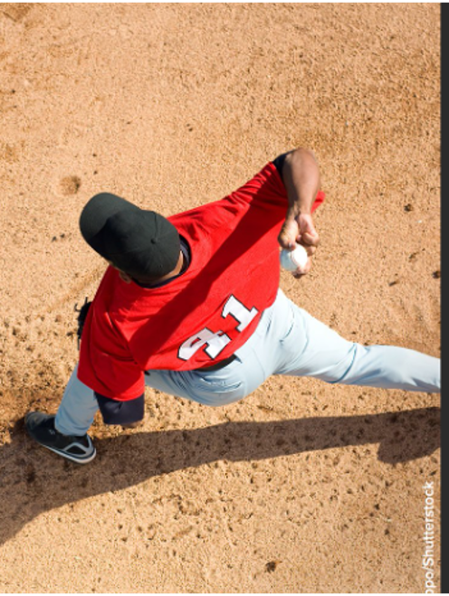{.fragment .absolute .fade-in-then-out
height="600" right="30"}

{.fragment .absolute height="600"
right="30"}

{.fragment .absolute height="600"
right="30"}

{.fragment .absolute height="600"
right="-360"}
:::
::::
::::::

## Implementation of warm-up i sports {.smaller}

### The throwing athlete - soldier

::::: columns
::: {.column width="50%"}
**How can we circumvent this throwing paradox?**

-   Increasing the range of motion elsewhere in the chain?

-   Increasing thoracic spine mobility in extension and rotation

-   Eliminates the excessive glenohumeral external rotation range of
    motion

-   Which avoids stress on the anterior capsule laxitiy and stress on
    bicpes brachii tendon (long head)

[@mayes_2022]
:::

::: {.column width="50%"}
{.fragment .absolute height="500"
top="100" right="-260"}
:::
:::::

::: notes
:::

## Implementation of warm-up i sports

### The throwing athlete / soldier

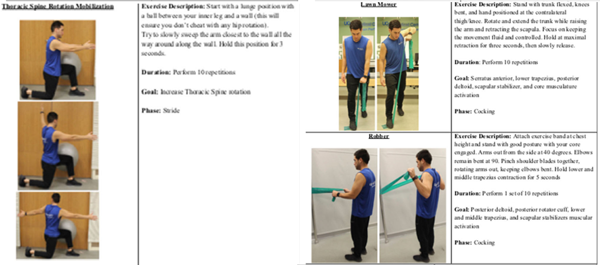

::: notes
-   
:::

## Implementation of warm-up i sports

### The throwing athlete / soldier

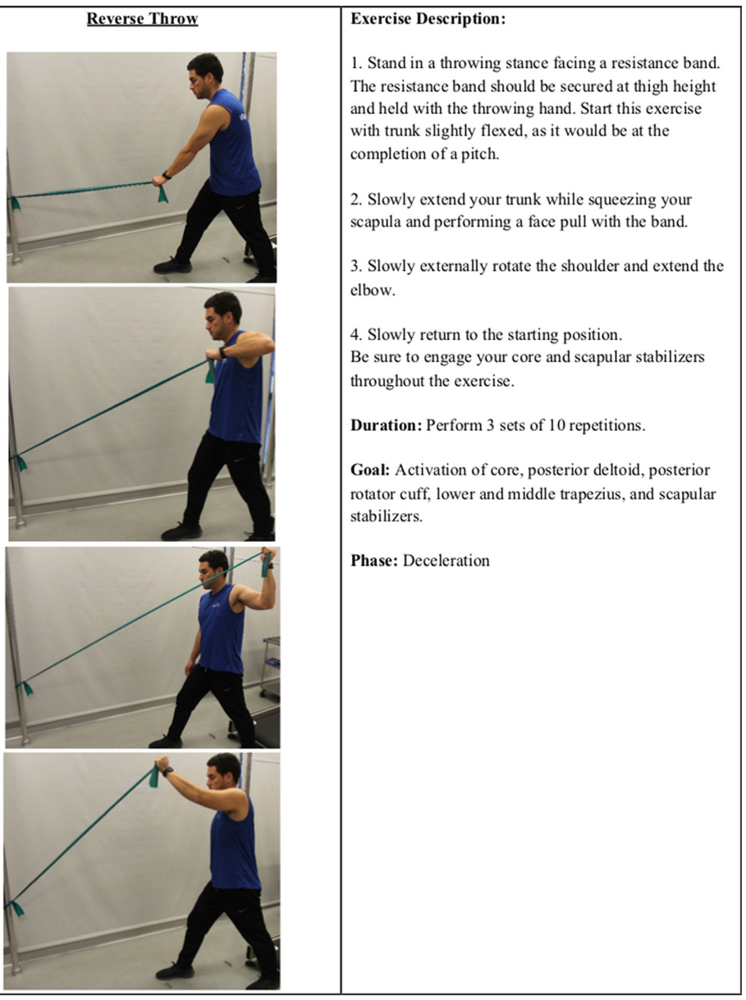

::: notes
-   The late cocking phase prepared the arm for forward acceleration and
    subsequent ball release
:::

## Implementation of warm-up i sports

### The throwing athlete

How does a proper warm-up session look like for an throwing athlete

-   Prevent pain and injury

-   Program should encompass

    -   thoracic spoine mobility exercises
    -   facilitate shoulder stabilizers trapezius, rotator cuff muscles,
        scapula stabilizers (m. trapezius)
    -   warm-up reduces risk on injury in all phases of a throw

# Warm-up and the link to performance

## Power of warm-up

### Are there any guidelines to use in the literature?

```{r intensityplot}
#| echo: false
#| warning: false
#| message: false


df_per <- data.frame(
  x=c(0, 20, 40, 60, 70, 80),
  y=c(75, 85, 95, 100, 100, 90))
  
  

ggplot(df_per, aes(x = x, y = y, color = y)) + geom_smooth() +
  geom_vline(xintercept= c(60,70), linetype = "dashed", color="red") +
  
    labs(title = "Changes in performance following warm-up",
       x = "Warm-up intensity (% VO2max)",
       y = "Intermediate/Long-term performance\n (% max)",
       color = "Y value") +
  
  theme_classic()
  


```

::: {.absolute bottom=-25 left=0 style="font-size: 50%;"}
[Figure created with inspiration from @bishop_2003]
:::


::: {.notes}

- To maximise intermediate and long-term performance, it is important that the warm-up is of sufficient duration to elevate baseline VO2, WHILE causing minimal with fatigue.

- Following 5-6 min we will see a steady state VO2 consumption, and an intensity around 60-70 % within a timeframe of 10-15 min seems to enhance performance. 

- Longer duration and even higher intensity, may be counterintuitive, with decreasing muscle glycogen (energy storage in the mucles)..n 


Optimal 60-70% of VO2max folloed by 5 min recovery seems to enhance performance..
task specific burst of activity, myu provide further ergogenic benefits...


intermetidate to long term performance <5 min duration? like obstacle running or swim performance

:::


## Power of warm-up

### 7 dynamic exercises after 5 min of jogging

| Exercise            | Improved performance (cohens d) | % of studie*|
|---------------------|-------------------- |---------|
| Sprinting           | **-7.69% **(1.72)   | 69%     |
| Jumping             | **+8.61%** (0.61)   | 87%     |
| Agility performance | **-6.65%**  (1.40)  | 83%     |

: % of 19 studies showing improvements in performance

::: {.absolute bottom=-35 left=0 style="font-size: 50%;"}
Table created from @silva_2018
:::

::: {.notes}

- Dynamic stretching at the end of warm-up may improve explosive tasks and sprint performance'
- Static stretching prior to power dominant, speed and agility activities may result in performance deficits 

:::

## Power of warm-up {.smaller}

### Accociation to performance

::::: columns
::: {.column width="50%"}
An increase in muscle temperature of $\text{1}^{\circ}\text{C}$ can
enhance subsequent exercise performance by [2-5%]{.bg
style="--col: pink"} [@racinais_2010].
:::

::: {.column width="50%"}
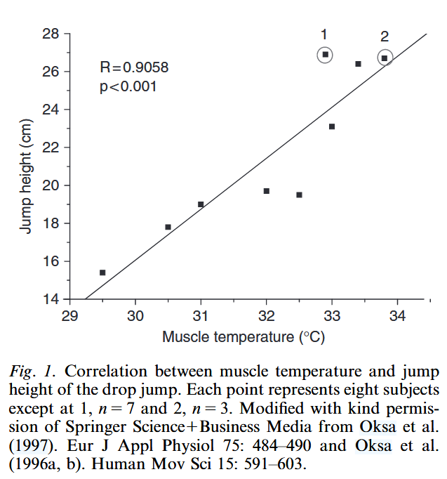

```{r corr plot}
#| fig-width: 6.0
#| fig-height: 10.0

# Read the image
corr_plot <- image_read("images/corr-temp-per.png")


```
:::
:::::

::: notes
-   
:::

## Power of warm-up  {.smaller}

### Accociation to performance

:::::: columns
:::: {.column width="50%"}
6 males (mean age 25)\
Cross-over design - separated by 14 days.

6 sec maximal sprint on a cycle ergometer

*First meeting*\
- Pre warmed thigh muscles in a bath ($\text{42.8}^{\circ}\text{C}$) for
30 min.

*Second meeting*\
- normal condition

::: {.fragment .custom .blur}
Results:\
Pre warmed to $\text{37.5}^{\circ}\text{C}$ vs. normal condition
$\text{34}^{\circ}\text{C}$

Performance at the sprints:\
Mean power output: **971 W vs. 859 W**
:::
::::

::: {.column width="50%"}
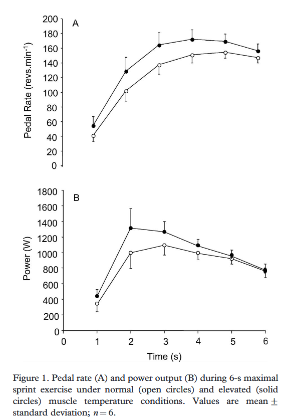{.absolute height="600" top="100"
right="60"}
:::
::::::

::: notes
Mean power output during the sprint was greater in the pre warm group
compared to the normal condition group

Probably due to the elevated temperature improves **cross-bridge cycling
between actin and myosin proteins in the muscle cell**.
:::

## Power of warm-up  {.smaller visibility="hidden"}

### Swimming

-   Pooled based warm-ups vs. dry-land-based warm-ups
    -   Performance?
-   Active vs. no warm-up
    -   Faster \[\] and similar \[\] performance after 1000 m
        pooled-based
-   Race-pace effort during warm-up (prime swimmers)
    -   Faster 50m split times \[\]

## Warm-up for performance {.smaller visibility="hidden"}

### Swimming

-   Transition phase

    -   Often long time between active warm-up and competition (often
        \>20 min)

-   Shorter transition phase (10vs. 45 min) is associated with better
    performance (200m) [@zochowski_2007]

    -   Maintain elevated core temperature

-   What to to?

    -   Should complete between 500 - 1200 m
    -   Include a short race pace efforts towards the end of of their
        pool warm-up

::: notes
1.  Coaches believe that this is superior as it is gaining a feel for
    the water

2.  However, this is not the case. Both methods can enhance swimming
    performance

3.  

4.  Dry-land activities can be a nice alternative to maintain elevated
    body core temperature
:::


# Take home and assignment

## Take home for injury prevention

-   Education of military leaders:
    -   Training load and intensity planing (total training load)\
    -   Resistance training
-   Warm-up strategies
    -   Injury
    -   Improve performance
-   Mobility exercises?

::: notes
Start with a case, problem,\
Set the stage\
And ask how would the students think of this in the light of this
lecture, alternative, illustrate how experts in this field would think
about it
:::

## Assignment for residental stay

Assignments for the delegations that needs to be prepared

-   [Romanian Cadets:]{.bg style="--col: yellow"} make a warm-up session
    for 30 min that prepare the fellow cadets for the obstacle course

-   [Greece cadets:]{.bg style="--col: lightblue"} make a warm-up
    session for 30 min that prepare the fellow cadets for grenade throw

-   [Latvian cadets:]{.bg style="--col: darkred"} make a warm-up session
    for 30 min that prepare the fellow cadets for the swimming course

-   [Bulgarian cadets:]{.bg style="--col: darkgreen"} make a warm-up
    session for 30 min that prepare the fellow cadets for the obstacle
    course

## References
