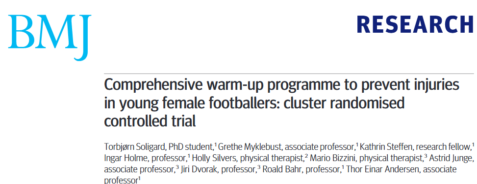

```{r}
library(tidyverse)
library(ggplot2)
```

## Flipped classrom approach {visibility="hidden"}

1- 10-15 min digital lecture + assignment\
2- in class - key points + group discussions related to injury
prevention strategies\
3- out class - example session made by and for the cadets

# Welcome to this learning module {.smaller}

::: {.fragment}
- Learning outcomes from this module: 
    
    1\. Knowledge of injury prevention strategies for military personnel
    
    2\. Knowledge of the purpose of warming up prior to exercise
    
    3\. Knowledge to set up a warm-up program for a specific workout session 

:::

::: {.fragment}
-   Our expectations to you   
    - Complete the digital lecture
    - Spend some time on the working material handed out on the platform and prepare the assignment together as a team (nation wise)

:::

::: {.fragment}

-   How is the working module organized to enhance learning
    - From the virtual to the residential part
    
:::

::: {.notes}

- My name is Sjur and Im Working as an associate professor at the Norwegian Defence Cyber Academy. 

  1. Knowledge of injury prevention strategies for military personnel

  2. Knowledge of the purpose of warming up prior to exercise (both for injury prevention and performance, and some main mechanisms that is occurring)

  3. Knowledge to set up a warm-up program for a specific workout session 
  
  
- The module about injury prevetnion and warming up is organized with the purpose of activating you as a learner. This means that you will be more active in your own learning process. Through the brief digital lectures and using the knowledge from the lecture together with the literature handed out you will develop a warm up program that you as a nation will execute on the other participating nations.

- At the residential stay you will present this program for the other participating nations before you will execute the program at the allocated time you will receive.

:::


## Outline of this lecture {.smaller}

::: {.fragment .fade-in-then-semi-out}
1. Acute vs. overuse injuries\
:::

::: {.fragment .fade-in-then-semi-out}
2. Which strategies do we have?\
:::

::: {.fragment .fade-in-then-semi-out}
3. Warm-up as a strategy\
:::

::: {.fragment .fade-in-then-semi-out}
4. Warm-up mechanisms\
:::

::: {.fragment .fade-in-then-semi-out}
5. Warm-up in sport to prevent injuries\
:::

::: {.fragment .fade-in-then-semi-out}
6. For the throwing athlete / soldier\
:::

::: {.fragment .fade-in-then-semi-out}
7. Warm up to improve performance\
:::

::: {.fragment .fade-in-then-semi-out}
8. Take home and working assignment\
- Your Academy will execute this warm-up program during the
residential stay
:::

::: {.notes}

-

:::

# Injuries in Military personnel

## Injuries in Military personnel

### Training-related injuries

:::{.fragment .semi-fade-out}

-   Injuries results in five to 22 times more days of limited duty than illnesses [@knapik_2004]
:::

::: {.fragment .fade-in-then-semi-out}
-  In 2019, 55% of active duty soldiers in the US army reported an injury (Musculoskeletal system)
:::

::: {.fragment .fade-in-then-semi-out}
 - 72% of these were considered to be overuse injuries [@vahi_2023]
:::


::: {.fragment .fade-in-then-semi-out}
-   Physical training is a primary cause and risk factor for musculoskeletal injuries [@wardle_2017]
    -   Recruits more vulnerable for injuries
    
:::

{.absolute bottom=-5 right=-170 height="230"}

::: notes

- First let us get an impression of the injury prevalence in military personnel 


- Physical training is a primary cause and risk factor for musculoskeletal injuries

-   yet developing and maintaining physical capability is a critical aspect of military training and employment

-   that is because the working demand require and maintain a high level of physical fitness (endurance, strength capacities), to ensure successful performance of military-specific tasks during training and operations

-   mitigation strategies for MSKI therefore include, but are not limited to, optimizing PT and also injury prevention strategies

-   but first, let us look into what is an injury and which definitions do we have.
:::


## Fron trial lecture to include in prevalence of injuries {.smaller visibility="hidden"}

- most common cuases of medical encounters are related to overuse injuries in the muscloskeletal injuries, whicle medical evacuations was due to musculoskeletal injuries due to sport activities or physical training (NINDL2012 p 2661).

[@nindl_2013]

- solution, more specific or tailored physical training, based upon individual needs and should be considered both pre-and during deployment.

- increased focus on sustaining and enhancing soldier stamina by implementing education, programs and policies to optimize aspects of activity, nutrition, and sleep amond the force. may maintain, restore and improve health by improving fitness and mitigatining illnesses and injuries NINDL2013.


## Definition of injuries {.smaller}

:::: panel-tabset
### Acute injuries

-   An acute injury is a sudden injury that occurs at a specific, identifiable moment, usually with a clear and defined cause

-   It results directly from tissue damage when the affected tissue is
    unable to withstand the load or force applied to it

::: {#injury layout-ncol="2"}


:::

### Overuse injuries
::: {.r-stack}

::: {.fragment fragment-index=1}
```{r injury}
#| echo: false
#| fig-width: 6.5
#| fig-height: 6.0

# Create a data frame with some points
data <- data.frame(
  x = c(-4, -3, -2, -1.5, -1, 0, 1, 2, 3, 4, 5),
  y = c(-6, -3.5, -4, -1, -2, 8, 4, 5, 3, 2, -4),
  yy = c(-6, -3.5, -4, -1, -2, 8, 4, 5, 3, 2, -4)
)

# Create a basic coordinate system and plot the points
injuryplot <- ggplot(data, aes(x = x, y = y)) + 
  geom_point(size = 3, color = "blue") +  # Plot points
  geom_line() +
    scale_y_continuous(
    # Features of the first axis
    name = "Tissue damage",
    # Add a second axis and specify its features
    sec.axis = sec_axis(trans=~.*10, name="Pain perception")
  ) +
   
  geom_vline(xintercept=0,
                linetype=4, colour="red")+
  geom_hline(yintercept=0,
                linetype=4, colour="red") +
  


  
  labs(title = "Overuse injury",
       x = "Time (weeks/months)",
       y = "Tissue damage") +  # Add labels
  theme_classic() + # Use a minimal theme
theme(axis.text.x = element_blank(),
      axis.text.y = element_blank(),
      #axis.title.x = element_text(size=4),
      plot.title = element_blank())

   injuryplot

```
:::


::: {.fragment fragment-index=2}
```{r injury11}
#| echo: false
#| fig-width: 6.5
#| fig-height: 6.0

injuryplot + 
  
  annotate("text", x=-2.5, y=-6, label= "Period with overuse") +
  annotate("text", x=-2.5, y=-0.5, label= "Periods with failed\n tissue adaptations") +
  
  
    geom_curve(aes(x = -4, y = -0.8, xend = -2, yend = -1),
    arrow = arrow(length = unit(0.3, "cm"), type = "closed"),
    color = "blue",
    size = 1.2,
    curvature = 0.3) +
  
   geom_curve(aes(x = -4, y = -0.8, xend = -3, yend = -3),
    arrow = arrow(length = unit(0.3, "cm"), type = "closed"),
    color = "blue",
    size = 1.2,
    curvature = 0.3) +

  
  labs(title = "Overuse injury",
       x = "Time (weeks/months)",
       y = "Tissue damage") +  # Add labels
  theme_classic() + # Use a minimal theme
theme(axis.text.x = element_blank(),
      axis.text.y = element_blank(),
      #axis.title.x = element_text(size=4),
      plot.title = element_blank())


```
:::


::: {.fragment fragment-index=3}
```{r injury2}
#| echo: false
#| fig-width: 6.5
#| fig-height: 6.0

injuryplot + 
  
   annotate("text", x=2.5, y=8.5, label= "Time of experienced injury\n Loss of duty time") +
  
    geom_curve(aes(x = 2.5, y = 7.8, xend = 0.3, yend = 8),
    arrow = arrow(length = unit(0.3, "cm"), type = "closed"),
    color = "blue",
    size = 1.2,
    curvature = -0.3) +
  
    annotate("text", x=-3.0, y=5.4, label= "Increased perception\n of pain") +
  
    geom_curve(aes(x = -3.0, y = 5.0, xend = -0.8, yend =2.2),
    arrow = arrow(length = unit(0.3, "cm"), type = "closed"),
    color = "blue",
    size = 1.2,
    curvature = 0.3) +
  
    labs(title = "Overuse injury",
       x = "Time (weeks/months)",
       y = "Tissue damage") +  # Add labels
  theme_classic() + # Use a minimal theme
theme(axis.text.x = element_blank(),
      axis.text.y = element_blank(),
      #axis.title.x = element_text(size=4),
      plot.title = element_blank())
  
  
  
```
:::

::: {.fragment fragment-index=4}
```{r injury3}
#| echo: false
#| fig-width: 6.5
#| fig-height: 6.0

injuryplot + 
  
   annotate("text", x=2.5, y=8.5, label= "Time of experienced injury\n Loss of duty time") +
  
    geom_curve(aes(x = 2.5, y = 7.8, xend = 0.3, yend = 8),
    arrow = arrow(length = unit(0.3, "cm"), type = "closed"),
    color = "blue",
    size = 1.2,
    curvature = -0.3) +
  
      annotate("text", x=-3.0, y=5.4, label= "Increased perception\n of pain") +
  
    geom_curve(aes(x = -3.0, y = 5.0, xend = -0.8, yend =2.2),
    arrow = arrow(length = unit(0.3, "cm"), type = "closed"),
    color = "blue",
    size = 1.2,
    curvature = 0.3) +
  
    annotate("text", x=3.2, y=7., label= "RTP / Return to duty attempt") +
    geom_curve(aes(x = 2.8, y = 6.8, xend = 2.3, yend =5),
    arrow = arrow(length = unit(0.3, "cm"), type = "closed"),
    color = "blue",
    size = 1.2,
    curvature = -0.3) +
  
  
    labs(title = "Overuse injury",
       x = "Time (weeks/months)",
       y = "Tissue damage") +  # Add labels
  theme_classic() + # Use a minimal theme
theme(axis.text.x = element_blank(),
      axis.text.y = element_blank(),
      #axis.title.x = element_text(size=4),
      plot.title = element_blank())
  
  
  
```
:::

::: {.fragment fragment-index=5}

```{r injury4}
#| echo: false
#| fig-width: 6.5
#| fig-height: 6.0

injuryplot + 
  
   annotate("text", x=2.5, y=8.5, label= "Time of experienced injury\n Loss of duty time") +
  
    geom_curve(aes(x = 2.5, y = 7.8, xend = 0.3, yend = 8),
    arrow = arrow(length = unit(0.3, "cm"), type = "closed"),
    color = "blue",
    size = 1.2,
    curvature = -0.3) +
  
      annotate("text", x=-3.0, y=5.4, label= "Increased perception\n of pain") +
  
    geom_curve(aes(x = -3.0, y = 5.0, xend = -0.8, yend =2.2),
    arrow = arrow(length = unit(0.3, "cm"), type = "closed"),
    color = "blue",
    size = 1.2,
    curvature = 0.3) +
  
    annotate("text", x=3.2, y=7., label= "RTP / Return to duty attempt") +
    geom_curve(aes(x = 2.8, y = 6.8, xend = 2.3, yend =5),
    arrow = arrow(length = unit(0.3, "cm"), type = "closed"),
    color = "blue",
    size = 1.2,
    curvature = -0.3) +
  
      annotate("text", x=2.8, y=-2.0, label= "RTP / Return to duty") +
    geom_curve(aes(x = 2.8, y = -2.8, xend = 4.8, yend =-4.2),
    arrow = arrow(length = unit(0.3, "cm"), type = "closed"),
    color = "blue",
    size = 1.2,
    curvature = 0.3) +
  
  
    labs(title = "Overuse injury",
       x = "Time (weeks/months)",
       y = "Tissue damage") +  # Add labels
  theme_classic() + # Use a minimal theme
theme(axis.text.x = element_blank(),
      axis.text.y = element_blank(),
      #axis.title.x = element_text(size=4),
      plot.title = element_blank())
  
  
  
```
:::


:::

::::


::: fragment
["Too much, too soon, and with too little rest"]{.bg
style="--col: pink"}
:::

::: notes

- acute: cuases that can be related to twisting your ankle during runing, or a contusion injury during close combat training....

- the mechanisms underlying acute injury is resulting directly from tissue damage when the affected tissue is unable to withstand the load or force applied to it

- WHEN it comes to overuse injuries, this is the most prevalent cause of all sports related injuries also in the military context

- Injuries that is gradually developing as a consequence of overuse over time Related to duration, intensity and frequency of training And the training load is greater than tissues ability to adapt over time

It is often related to monotonomy in loading patterns, or repetitive movements like throwing in sports or military force

- explain figure..
:::


## Injury prevetion strategies for military personnel

::: r-stack

```{r strat0}
#| out-width: 100%
#| 
# Load necessary libraries
library(magick)

# Read the image
tabrec <- image_read("images/table-rec.png")


tabrec

```

::: {.fragment fragment-index="1"}
```{r strat1}
#| out-width: 100%


# Load necessary libraries
library(magick)

# Read the image
tabrec <- image_read("images/table-rec.png")

# Define the coordinates and radius for the circles
circles <- data.frame(
  x = c(100),  # x-coordinates of the centers
  y = c(180),  # y-coordinates of the centers
  r = c(55)      # radii of the circles
)

# Draw circles on the image
for (i in 1:nrow(circles)) {
  tabrec <- image_draw(tabrec)
  symbols(circles$x[i], circles$y[i], circles$r[i], inches = FALSE, add = TRUE, fg = "red")
  dev.off()
}

# Display the image

tabrec

```
:::

::: {.fragment fragment-index="2"}
```{r strat2}
#| out-width: 100%

circles2 <- data.frame(
  x = c(100, 100),  # x-coordinates of the centers
  y = c(180, 300),  # y-coordinates of the centers
  r = c(55, 55)      # radii of the circles
)

# Draw circles on the image
for (i in 1:nrow(circles2)) {
  tabrec <- image_draw(tabrec)
  symbols(circles2$x[i], circles2$y[i], circles2$r[i], inches = FALSE, add = TRUE, fg = "red")
  dev.off()
}

# Display the image
tabrec


```
:::

::: {.fragment fragment-index="3"}
```{r strat3}
#| out-width: 100%

circles3 <- data.frame(
  x = c(100, 100, 100),  # x-coordinates of the centers
  y = c(180, 300, 420),  # y-coordinates of the centers
  r = c(55, 55, 55)      # radii of the circles
)

# Draw circles on the image
for (i in 1:nrow(circles3)) {
  tabrec <- image_draw(tabrec)
  symbols(circles3$x[i], circles3$y[i], circles3$r[i], inches = FALSE, add = TRUE, fg = "red")
  dev.off()
}

# Display the image
tabrec


```
:::

::: {.fragment fragment-index="4"}
```{r strat4}
#| out-width: 100%

circles4 <- data.frame(
  x = c( 102),  # x-coordinates of the centers
  y = c( 235),  # y-coordinates of the centers
  r = c( 45)           # radii of the circles
)

# Draw circles on the image
for (i in 1:nrow(circles4)) {
  tabrec <- image_draw(tabrec)
  symbols(circles4$x[i], circles4$y[i], circles4$r[i], inches = FALSE, add = TRUE, fg = "blue")
  dev.off()
}

# Display the image
tabrec


```
:::


:::

Table from @wardle_2017 review

::: notes

- So what is the literature saying about injury prevention strategies in a military context.. 

- and is there strategies that are recommended to implement in the military to reduce risk of injury...

- In this review from 2017 from Waardle and Greeves, the authors included 61 studies for a qualitative synthesis and found good evidence for some strategies that most likely can be recommended to prevent injuries..this was both studies from athletic and military populations..


- improving overall physical fitness is recommended, the more fit you are you are more likely resilient towards muscleskeltal injuries.. 

- Leadership and supervision—especially through education—played a major role in injury prevention programs. In fact, programs that included education saw about a 30% drop in injuries. This tells us that understanding what soldiers are exposed to, and knowing how to prevent those risks, is absolutely critical for military leaders looking to protect their troops.

For example, it’s important when creating a training plan to consider the many stress factors soldiers face. If those aren't accounted for, it can lead to overtraining and increase the risk of musculoskeletal injuries.

- When it comes to training volume, reducing training volume—especially during the initial phase of military training—can actually be beneficial for the soldier. Gradually increasing the physical load gives the body time to adapt and can help prevent overuse injuries.

In fact, during initial training, somewhere between 25 to 50% of injuries are linked to physical training. A big part of that seems to come from pushing too hard, too soon—especially for those who start with lower fitness levels.


Interestingly, in this review, conditioning on its own didn’t show strong or consistent evidence as a way to prevent injuries—which might be a bit surprising. The findings across different studies were mixed. That said, it’s important to note that conditioning programs didn’t increase injury risk either, so there were no observed negative effects.

Part of the reason for the mixed results may be that there just aren’t enough high-quality military studies available on this topic yet.

That being said, a common theme that does come up in the research is the benefit of structured, progressive training—like running programs that start with low mileage and intensity, and then slowly increase distance and speed. This gradual approach helps the body adapt and reduces the risk of injury 
[Bullock2010.]

And one thing we do have consensus about, is the importance of warm-up programs. Warming up before physical workout or competition is a proven and effective strategy for reducing the risk of injuries. It's simple, can be time effective, and something every unit can implement consistently.

:::


# Mechanisms of Warm-up

## Mechanisms of Warm-up {visibility="hidden"}

```{r intro, message=FALSE, echo=FALSE, warning=FALSE}

# Load necessary libraries
library(magick)
library(ggplot2)

# Read the image
image <- image_read("images/frontimage.jpg")

# Create an arrow annotation
arrow <- image_draw(image)
arrows(x0 = 570, 
       x1 = 750,
       y0 = 450, 
       y1 =450, 
       length = 0.25, lwd=7, angle = 30, code = 1, col="pink")
arrows(x0 = 540, 
       x1 = 750,
       y0 = 200, 
       y1 =450, 
       length = 0.25, lwd=7, angle = 30, code = 1, col="pink")
arrows(x0 = 510, 
       x1 = 750,
       y0 = 550, 
       y1 = 450, 
       length = 0.25, lwd=7, angle = 30, code = 1, col="pink")
dev.off()


arrow

# Save the annotated image
#image_write(image_with_text, path = "images/CISK_arr.png")

```


::: {.notes}

- 

:::


## Mechanisms of Warm-up

:::::::: r-stack

::: fragment
```{r 1}
#| out-width: 100%

wup <- image_annotate(arrow, "Possible warm-up mechanisms", size = 30, color = "pink", location = "+750+400") 

wup

```
:::

::: fragment
```{r 2}
#| out-width: 100%

 wup |> 
  image_annotate("Muscle temperature", size = 30, color = "white", location = "+550+450") 

```
:::

::: fragment
```{r 3}
#| out-width: 100%

 wup |>
  image_annotate("Muscle temperature", size = 30, color = "white", location = "+550+450") |> 
  image_annotate("ATP turn over rate", size = 30, color = "white", location = "+250+500")
  

```
:::

::: fragment
```{r 4}
#| out-width: 100%

 wup |>
  image_annotate("Muscle temperature", size = 30, color = "white", location = "+550+450") |> 
  image_annotate("ATP turn over rate", size = 30, color = "white", location = "+250+500") |> 
  image_annotate("Oxygen kinetics", size = 30, color = "white", location = "+550+120")
  


```
:::

::: fragment
```{r 5}
#| out-width: 100%

 wup |>
  image_annotate("Muscle temperature", size = 30, color = "white", location = "+550+450") |> 
  image_annotate("ATP turn over rate", size = 30, color = "white", location = "+250+500") |> 
  image_annotate("Oxygen kinetics", size = 30, color = "white", location = "+550+120") |> 
  image_annotate("Muscle contractile performance", size = 30, color = "white", location = "+550+550") 


```
:::

::::::::

[@mcgowan_2015]

::: notes

1. The main goal of a warm-up is to raise your body and muscle temperature. When muscles are warmer, they work more efficiently—largely because the energy systems inside the muscle, especially the ATP turnover rate, speed up. That means the muscle can generate energy faster and more effectively.

2. Warm-ups also help with oxygen delivery. They “prime” the body to start taking in and using oxygen more quickly (so to say), as your baseline VO2 is elevated during warm up. That’s important, because it spares your limited anaerobic energy stores for later in the workout or performance during sprints, when you really need them.
And there’s more — research by Zochowski (2007) shows that warm-up promotes vasodilation, or the widening of blood vessels in the muscles. This helps more oxygen-rich blood get to where it’s needed. At 41°C, hemoglobin releases nearly twice as much oxygen to the muscles compared to 36°C, and it does so more quickly.

3. Another benefit of warmer muscles is better power output. As the muscle temperature increases, the rate of force development improves. That’s partly because the little microscopic processes inside the muscle—like cross-bridge cycling—become more efficient. It also boosts the function of your central nervous system, helping your body react and move more effectively.

4. There’s also evidence for every 1°C increase in muscle temperature, performance can improve by 2 to 5% [@Racinais2010]. That’s significant, especially in a military or high-performance setting.

5. So to sum up: not only do muscles get more oxygen, but they also get it faster—which sets you up to start your workout or mission with a higher baseline level of oxygen use. That means you’re relying less on anaerobic systems right off the bat, which helps you last longer and perform better.


1.  Main event of warm-up is the increase in body and muscle temperature, wherein higher temperature facilitaate work more effectively through a greater muscle metabolism (by greater turnover rate of energy packages in the muscle, named ATP turn over rate).

2.  O2-kinetics: warm-up can prime the body to an elevated oxygen uptake and aerobic metabolisms can contribute to spare finite anaerobic stores during the initial stages of an exercise bout, thus preserving this energy for subsequent use.

3.  With a greater muscle temperature an increase in power output is observed through as the rate of force development increases due to an optimized cross-bridge cycling rate.- Improves central-nervous-system function (p 202)  

-   Theory: an increase in muscle temperature of $\text{1 }^{\circ}\text{C}$ can enhance subsequent exercise performance by 2-5% [@racinais_2010].

In zochowski 2007 - Enhanced performance has been associated with vasodilation of muscle blood vessels and the associated rightward short of the oxyhemoglobin-dissociation curve after warm-up. 
- Hemoglobin gives up almost twice as much oxygen at $\text{41 }^{\circ}\text{C}$ as at $\text{36 }^{\circ}\text{C}$, and oxygen dissociates twice as rapidly. 

- Warm-up can allow subsequent tasks to begin with an elevated baseline $\text{VO}_{2}$. Resulting in less of the initial work is completed anaerobically.


:::

# Warm-up for Injury Prevention


## Power of warm-up

### Is it important to have a structured warm-up?

- Equally important (to plan as the main session)
  - effective and keep the overall training load minimal

- Activities that contribute to the aims of the overall session

- Usually ~10-30 min 


::: {.notes}

The warm-up is just as important to plan as the main session itself. When done right, it’s effective without adding too much to the overall training load.

A good warm-up should directly support the goals of the main workout—everything in it should help prepare the body for what’s coming next.

Typically, it lasts anywhere from 10 to 30 minutes, depending on the intensity and demands of the session that follows.

:::


## Power of warm-up

### Are there any guidelines to use in the literature?


::: {.r-stack}

::: {.fragment}

```{r intensity}
#| echo: false
#| message: false
#| warning: false
#| fig-align: center
#| fig-height: 6.5
#| fig-width: 6.5


library(tidyverse)

# Simulate some data
set.seed(123)
df <- data.frame(
  x = 1:100,
  y = sort(runif(100, 0, 100))) |> 
  
  mutate(RAMP = ifelse(x == 10, "RAISE",
                       ifelse(x == 50, "Activate and Mobilize",
                              ifelse(x == 85, "Potentiation",x)))) 
  
# Create the ggplot
RAMP <- ggplot(df, aes(x = x, y = y, color = y)) +
  
  geom_line(size = 3) +
  scale_color_gradient(low = "lightblue", high = "darkblue") +
  
  labs(title = "Performance / Workout ready",
       x = "RAMP-method",
       y = "Intensity of exercise",
       color = "Y Value") +
  
  
  
  # add arrow line
  annotate(
  geom = "segment", x = 4, y = 0, xend = 95, yend = 0, 
   arrow = arrow(length = unit(2, "mm"), type="closed")) +
   annotate("text", x=50, y=3, label="Specificity", colour="purple", size=5.3) +
  
  
  theme_classic() +
  theme(axis.text.x = element_blank(),
        legend.position = "none")

  

RAMP


```
:::

::: {.fragment}
```{r intensity1}
#| echo: false
#| message: false
#| warning: false
#| fig-align: center
#| fig-height: 6.5
#| fig-width: 6.5


library(tidyverse)


# Simulate some data
set.seed(123)
df <- data.frame(
  x = 1:100,
  y = sort(runif(100, 0, 100))) |> 
  
  mutate(RAMP = ifelse(x == 10, "RAISE",
                       ifelse(x == 50, "Activate and Mobilize",
                              ifelse(x == 85, "Potentiation",x)))) 
  
# Create the ggplot
RAMP +
  annotate("text", x=10, y=37, label="Raise", colour="purple", size=5.3) +
  annotate("rect", xmin = 0, xmax = 25, ymin = 10, ymax = 35,
  alpha = .2) +
  annotate("text", x=12, y=15, label="Run, technique,\n low intensity") 
  
 

  


```
:::

::: {.fragment}
```{r intensity2}
#| echo: false
#| message: false
#| warning: false
#| fig-align: center
#| fig-height: 6.5
#| fig-width: 6.5


RAMP +
  # Raise
  annotate("text", x=10, y=37, label="Raise", colour="purple", size=5.3) +
  annotate("rect", xmin = 0, xmax = 25, ymin = 10, ymax = 35,
  alpha = .2) +
  annotate("text", x=12, y=15, label="Run, technique,\n low intensity") +
  
  # Activate
  annotate("text", x=50, y=68, label="Activate and Mobilize", colour="purple", size=5.3) +
  annotate("rect", xmin = 30, xmax = 65, ymin = 35, ymax = 65,
  alpha = .2)+
  annotate("text", x=48, y=40, label="Muscle-\n specific activation") 
  
  
  
  
```
:::

::: {.fragment}
```{r intensity3}
#| echo: false
#| message: false
#| warning: false
#| fig-align: center
#| fig-height: 6.5
#| fig-width: 6.5


RAMP +
# Raise
  annotate("text", x=10, y=37, label="Raise", colour="purple", size=5.3) +
  annotate("rect", xmin = 0, xmax = 25, ymin = 10, ymax = 35,
  alpha = .2) +
  annotate("text", x=12, y=15, label="Run, technique,\n low intensity") +
  
  # Activate
  annotate("text", x=50, y=68, label="Activate and Mobilize", colour="purple", size=5.3) +
  annotate("rect", xmin = 30, xmax = 65, ymin = 35, ymax = 65,
  alpha = .2)+
  annotate("text", x=48, y=40, label="Muscle-\n specific activation") +
  
  # Potentiate
  annotate("text", x=87, y=100, label="Potentiation", colour="purple", size=5.3) +
  annotate("rect", xmin = 75, xmax = 100, ymin = 65, ymax = 98,
  alpha = .2) +
  annotate("text", x=88, y=76, label="Sport-\n specific exercises") 
  

```
:::

:::

::: {.absolute bottom=-35 left=-80 style="font-size: 45%;"}
[Figure created with<br> inspiration from @jeffreys_2007]
:::

::: {.notes}

One effective way to structure a warm-up is by using the RAMP method. It’s a simple and practical framework that helps guide the design of warm-ups for both training and competition.

RAMP stands for:
Raise, Activate, Mobilize, and Potentiate.

- Raise is the first step. The goal here is to increase body temperature, heart rate, breathing rate, blood flow, and joint mobility. This is usually done with low-intensity activities—like light jogging, cycling, or dynamic movement—just enough to get the system going.

- Next comes Activate and Mobilize. This step focuses on turning on the key muscle groups you’ll be using, and getting the body moving through the patterns needed for your specific activity. So if you're training for something like an obstacle course or grenade throwing, the warm-up should include movements that mimic those tasks. This part is all about specificity.

- The last part is Potentiation, and that’s where we ramp things up. The idea is to gradually increase the intensity so your body is fully ready for high-performance efforts.

For a sprint workout, that might mean sprint drills followed by short sprints at increasing speeds.

For strength training, it could involve explosive movements—like plyometrics or gradually heavier lifts—to wake up the nervous system and get the muscles firing.

* Now, there’s a balance here: you want to raise your baseline oxygen consumption and get those performance systems going—but if the warm-up is too intense or the recovery time too short, it can actually reduce performance. That’s because high-energy phosphate stores might get depleted, and you could end up with a build-up of fatigue products like lactate or hydrogen ions.

* So in general, a good warm-up lasts about 10 to 30 minutes, starts at lower intensity and builds up to 70-90% of your max heart rate. It should finish with high-intensity, sport-specific movements—like sprints—to trigger that PAP effect, or post-activation potentiation, and get you primed for action.


------

One way of structuring an effective warm-up protocol is to follow the RAMP-method. The RAMP framewok approach provides a framework around which to construct effective warm-up procedures for both competition and the workout

- RAISE: Aims to elevate body temperature, heart rate, respiration rate, blood flow, and joint viscosity via low-intensity activities

- Activate and mobilize: involves a series of specific dynamic key movement patterns involved in sports, toghether with a focus of key muscles that need to be activated to produce these movements (specificity to you sport or performance like obstacle course or throwing grenades..)


- Potentiation: aims to increase activity to **maximal intensity** and potentiate PAP
  - The aim of this part is to gradually shift towards the actual sport performance or workout itself.
  - and will involve sport specific activities of increasing intensity...

  - A sprint workout will comprose of sprint drills and sprints of increasing intensity or
  - reistance training workout, will involve acitivites such as plyometric, and progressive and explosive resistance exercises to provide a progression towards the workout itself.


- Trade off between to high intensity (to increase baseline VO2), to intense warm up and short recovery period. 
- Performance may be impaired due to decrease in high-energy phosphate stores and accumulation of H+/lactate... 


- In general the warm-up should be between 10-20 min, progressive in intensity (50-90% HRmax with the aim to increase body temperature and prepare for specific tasks of the sport, and end with tasks of maximum intensity such as sprints (90%) to induce the PAP effect.

:::


## Power of warm-up

### Warm-up strategies

:::: {.columns}

::: {.column width="50%"}


{.absolute bottom=0 left=0 width="170" height="150"}
{.absolute bottom=0 left=230 width="170" height="165"}

:::

::: {.column width="50%"}
-   Dynamic warm up should include agility, plyometrics, power, core and
    balance

-   These components enhance muscle flexibility, joint mobility, and
    neuromuscular activation, which is essential for optimal injury
    prevention

:::

::::

::: {.absolute bottom=-35 left=0 style="font-size: 50%;"}
[@soligard_2008; @kirkendall_2010]
:::

::: notes

- Regular use of dynamic exercises in warm-ups has been linked to a lower risk of musculoskeletal injuries in both athletic and military populations, due to improved movement control and tissue preparedness [Pope et al., 2000; Herman et al., 2012].

- Dynamic exercises are more effective than static stretching at improving power, strength, and sprint performance during subsequent activities [Behm & Chaouachi, 2011].


:::

## Implementation of warm-up i sports {.smaller}

### Specificity to exercise

:::: {.columns}

::: {.column width="50%"}


::: {.absolute top=200 left=-50}

::: {.fragment .fade-in-then-semi-out}

- **Aim:** Comprehensive warm-up program<br> during one season (intervention group)

- 125 clubs randomised

:::

::: {.fragment .fade-in-then-semi-out}
Program consisted of dynamic-<br>movement exercises

-   Six different sets of exercise (football)\
    1 Slow running with dynamic movements\
    2 Strength - plyometrics and balance (10 min)\
    3 Speed running specific to football<br> (sudden changes/direction/agility)
:::

:::

:::

::: {.column width="50%"}

{.absolute top=120 height="200"}


::: {.fragment .absolute top=320}

**Outcome/ Results:**

The risk of severe injuries, overuse injuries, and injuries overall was reduced in the intervention group


*Can reduce the risk of injury with 50%*
:::

:::

::::

::: {.absolute bottom=0 style="font-size: 60%;"}
[@soligard_2008; @kirkendall_2010]
:::

::: notes
-   plank, side plank, nordic hamstring, single leg balance
-   jumping exercise
-   fast runing exercises


- This indicates that a structured warm-up programme can prevent injuries in young female football players.


:::


# Warm-up For Injury Prevention

### The throwing athlete


## Implementation of warm-up - The throwing athlete {.smaller}

### Specificity to exercise movement

:::: {columns}

::: {.column width="50"}

::: {.fragment fragment-index=1 .fade-in-then-semi-out}
-   Having a greater flexibility in external rotation can benefit the
    throwing performance
:::

::: {.fragment fragment-index=2 .fade-in-then-semi-out}
-   However, excessive stretching can exacerbate capsule laxity and lead
    to shoulder instability
:::

::: {.fragment fragment-index=3 .fade-in-then-semi-out}
-   Stretching together with repetitive throwing motions with extreme
    external rotation can lead to capsular instability and injury
    (labrum and rotator cuff muscles)
:::

:::

::: {.column width="50"}

::: r-stack
{.fragment fragment-index=1 .absolute height="500" right="30"}

{.fragment fragment-index=2 .absolute height="500" right="30"}

{.fragment fragment-index=3 .absolute height="500" right="30"}

{.fragment fragment-index=4 .absolute height="500" right="-300"}
:::
:::

::::


::: {.notes}

- don't forget the last fragment to illustrate same issues with the soldier

:::

## Implementation of warm-up i sports {.smaller}

### The throwing athlete - soldier

::::: columns

::: {.column width="50%"}
**How can we circumvent this throwing paradox?**

::: {.fragment fragment-index=1 .fade-in-then-semi-out}
-   Increasing the range of motion elsewhere in the chain?
:::

::: {.fragment fragment-index=2 .fade-in-then-semi-out}
-   Increasing thoracic spine mobility in extension and rotation
:::

::: {.fragment fragment-index=3 .fade-in-then-semi-out}
-   Eliminates the excessive glenohumeral external rotation range of
    motion
:::

::: {.fragment fragment-index=4 .fade-in-then-semi-out}
-   Which avoids stress on the anterior capsule laxity and stress on
    m.bicpes brachii tendon (long head)
:::

[@mayes_2022]
:::

::: {.column width="50%"}
{.fragment fragment-index=2 .absolute height="500" top="100" right="-260"}
:::
:::::

::: notes


:::

## Implementation of warm-up i sports

### The throwing athlete / soldier


::: notes
-   
:::

## Implementation of warm-up i sports

### The throwing athlete / soldier


::: notes
-   The late cocking phase prepared the arm for forward acceleration and
    subsequent ball release
:::

## Implementation of warm-up i sports

### Summary - specific to a movement

How does a proper warm-up session look like for an throwing athlete

-   Program should encompass

    -   thoracic spine mobility exercises
    -   facilitate shoulder stabilizers trapezius, rotator cuff muscles,
        scapula stabilizers (m. trapezius)
    -   warm-up reduces risk on injury in all phases of a throw


## Passive Warm-Up

-   Not commonly used

-   Seems to only be a meaningful advantage to *maintain* an elevated
    body temperature (achieved by active movements) throughout the
    transition phase

::: notes
- transition phase is the time window during competition where you will wait for your start time point where you can't do any specific exercise (i.e call room in field and track competition)


:::

# Summary 

## Summary of injury prevention strategies

1\. There is recommendations for injury prevention strategies in military personnel\
    - Knowledge and supervision (training plan - volume and  warming up strategy)\
    - Physical fitness

2\. Warm-up using the RAMP-method\
    - Raise - Activate - Potentiate


# Warm-up and the link to performance

## Power of warm-up

### Are there any guidelines to use in the literature?

```{r intensityplot}
#| echo: false
#| warning: false
#| message: false


df_per <- data.frame(
  x=c(0, 20, 40, 60, 70, 80),
  y=c(75, 85, 95, 100, 100, 90))
  
  

ggplot(df_per, aes(x = x, y = y, color = y)) + geom_smooth() +
  geom_vline(xintercept= c(60,70), linetype = "dashed", color="red") +
  
    labs(title = "Changes in performance following warm-up",
       x = "Warm-up intensity (% VO2max)",
       y = "Intermediate/Long-term performance\n (% max)",
       color = "Y value") +
  
  theme_classic()
  


```

::: {.absolute bottom=-25 left=0 style="font-size: 50%;"}
[Figure created with inspiration from @bishop_2003]
:::


::: {.notes}

If we want to maximize performance—not just in the short term, but over the intermediate and long term—it’s important to get the warm-up right. That means making it long enough and intense enough to raise baseline oxygen consumption, or VO₂, without overloading the body and causing early fatigue.

After about 5 to 6 minutes of warm-up, the body reaches a steady state of VO₂ uptake. Research suggests that working at about 60 to 70% of VO₂max for around 10 to 15 minutes can really help boost performance. That level of intensity is enough to get the aerobic system fully engaged, but not so much that it drains your energy.

Going harder or longer than that might seem like it would help—but it can actually backfire. Higher-intensity or overly long warm-ups can start to eat into muscle glycogen, which is your muscles’ main fuel. That can leave you feeling flat, especially in events that require bursts of power or endurance.

The sweet spot seems to be around 60–70% of VO₂max followed by about 5 minutes of recovery, which allows the body to reset just enough before going all out. Adding in a few task-specific bursts of activity—like short sprints or explosive movements—right before performance may give an extra edge by triggering the neuromuscular system.

And this becomes especially important in events under 5 minutes—like an obstacle course run or military swim—where you need to hit high intensity right from the start. A properly structured warm-up helps ensure you’re physiologically and mentally ready to do that without burning out too early.

-----


- To maximise intermediate and long-term performance, it is important that the warm-up is of sufficient duration to elevate baseline VO2, WHILE causing minimal with fatigue.

- Following 5-6 min we will see a steady state VO2 consumption, and an intensity around 60-70 % within a timeframe of 10-15 min seems to enhance performance. 

- Longer duration and even higher intensity, may be counterintuitive, with decreasing muscle glycogen (energy storage in the mucles)..n 


Optimal 60-70% of VO2max folloed by 5 min recovery seems to enhance performance..
task specific burst of activity, myu provide further ergogenic benefits...


intermetidate to long term performance <5 min duration? like obstacle running or swim performance

:::


## Power of warm-up

### 7 dynamic exercises after 5 min of jogging

| Exercise            | Improved performance (cohens d) | % of studie*|
|---------------------|-------------------- |---------|
| Sprinting           | **-7.69% **(1.72)   | 69%     |
| Jumping             | **+8.61%** (0.61)   | 87%     |
| Agility performance | **-6.65%**  (1.40)  | 83%     |

: % of 19 studies showing improvements in performance

::: {.absolute bottom=-35 left=0 style="font-size: 50%;"}
Table created from @silva_2018
:::

::: {.notes}

- Dynamic stretching at the end of warm-up may improve explosive tasks and sprint performance'
- Static stretching prior to power dominant, speed and agility activities may result in performance deficits 

:::


## Power of warm-up {.smaller}

### Accociation to performance

::::: columns
::: {.column width="50%"}
An increase in muscle temperature of $\text{1}^{\circ}\text{C}$ can
enhance subsequent exercise performance by [2-5%]{.bg
style="--col: pink"} [@racinais_2010].
:::

::: {.column width="50%"}


```{r corr plot}
#| fig-width: 6.0
#| fig-height: 10.0

# Read the image
corr_plot <- image_read("images/corr-temp-per.png")


```
:::
:::::

::: notes
-   
:::

## Power of warm-up  {.smaller}

### Accociation to performance

:::::: columns
::: {.column width="60%"}

**Participants and Design:**\
6 males (mean age 25)\
Cross-over design - separated by 14 days

*Outcome:*
6 sec maximal sprint on a cycle ergometer

::: {.fragment .custom .blur}
*First meeting*\
- Pre warmed thigh muscles in a bath ($\text{42.8}^{\circ}\text{C}$) for
30 min

*Second meeting*\
- Normal condition
:::

::: {.fragment .custom .blur}
**Results:**\
Pre warmed to $\text{37.5}^{\circ}\text{C}$ vs. normal condition
$\text{34}^{\circ}\text{C}$

Performance at the sprints:\
Mean power output: **971 W vs. 859 W**
:::

:::

::: {.column width="40%"}
{.absolute height="600" top="100" right="35"}
:::

::::::

::: notes

Mean power output during the sprint was greater in the pre warm group
compared to the normal condition group

Probably due to the elevated temperature improves **cross-bridge cycling
between actin and myosin proteins in the muscle cell**.
:::

## Power of warm-up  {.smaller visibility="hidden"}

### Swimming

-   Pooled based warm-ups vs. dry-land-based warm-ups
    -   Performance?
-   Active vs. no warm-up
    -   Faster \[\] and similar \[\] performance after 1000 m
        pooled-based
-   Race-pace effort during warm-up (prime swimmers)
    -   Faster 50m split times \[\]

## Warm-up for performance {.smaller visibility="hidden"}

### Swimming

-   Transition phase

    -   Often long time between active warm-up and competition (often
        \>20 min)

-   Shorter transition phase (10vs. 45 min) is associated with better
    performance (200m) [@zochowski_2007]

    -   Maintain elevated core temperature

-   What to to?

    -   Should complete between 500 - 1200 m
    -   Include a short race pace efforts towards the end of of their
        pool warm-up

::: notes
1.  Coaches believe that this is superior as it is gaining a feel for
    the water

2.  However, this is not the case. Both methods can enhance swimming
    performance

3.  

4.  Dry-land activities can be a nice alternative to maintain elevated
    body core temperature
:::


# Take home and assignment

## Take home for injury prevention

-   Education of military leaders:
    -   Training load and intensity planing (total training load)\
    -   Progression in training load
    
-   Warm-up strategies
    -   Injury
    -   Improve performance
    

::: notes

I want to highlight two or three key takeaways from this lecture that, as a future leader of military personnel, you need to be aware of in order to help prevent injuries among your soldiers.

First, it's crucial to have a structured training plan that considers the total training load your soldiers are exposed to—both during their education and in active service. This helps reduce the risk of overuse injuries and failed physical adaptation. The plan should be adjusted to reflect the actual stressors they face in their daily tasks. In other words, make sure the volume, intensity, and frequency of training match what their bodies can handle—especially during demanding periods.

Second, gradual progression in training is key—especially for new recruits who may not be very fit when they join. Pushing them too hard, too fast is a fast track to injury. Building up their load steadily gives their bodies time to adapt safely.

Third, make structured warm-up sessions a regular part of their weekly training routine, all year round. Warm-ups are not just about preventing injury—they also help improve performance in the training that follows.

To sum up: be smart with load, progress gradually, and never skip the warm-up. These simple principles go a long way in keeping your soldiers healthy and mission-ready.

:::

## Assignment for residental stay

Assignments for the delegations that needs to be prepared for residental stay

-   [Romanian Cadets:]{.bg style="--col: yellow"} make a warm-up session
    for 30 min that prepare the fellow cadets for the obstacle course

-   [Greece cadets:]{.bg style="--col: lightblue"} make a warm-up
    session for 30 min that prepare the fellow cadets for grenade throw

-   [Slovakian cadets:]{.bg style="--col: red"} make a warm-up session
    for 30 min that prepare the fellow cadets for the swimming course

-   [Bulgarian cadets:]{.bg style="--col: darkgreen"} make a warm-up
    session for 30 min that prepare the fellow cadets for the obstacle
    course

## References
