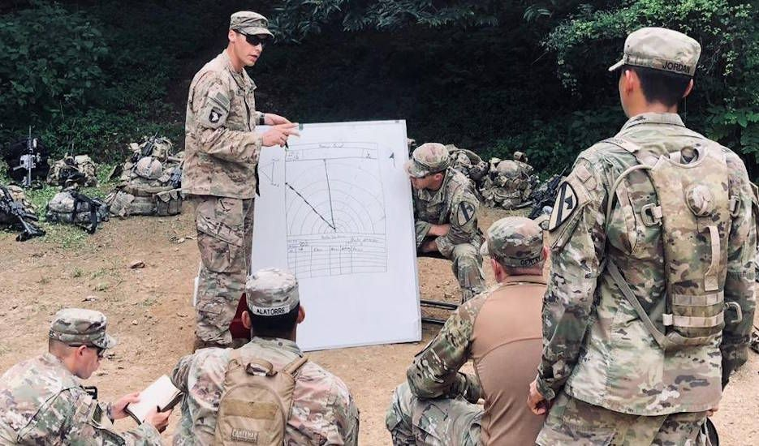

# The in classrom lecture

## Outline

- question

- recap some key points from virtual component - add some new aspects

  - guidelines
  
  - *how is a typical training session look like in your academy? get together and discuss?*
  
  - present your warm-up programs to the forum with reflection (send in your presentation in advance, 5 min).
  

- Today one academy will execute the warm up program for us and we will follow it as planned.

## How do you avoid getting injured during service? [during residental stay]

Start the lecture with a question or case.

-   What is your strategy(ies) to prevent getting injured while in the
    military service?

    -   Use two minutes to discuss with your fellow cadet
    
    
## RAMP-method

- Describe?

## Startegies to prevent injuries in military personnel {visibility="hidden"}

- Recap strategies?

1\. Education of military leaders

2\. Prevent overtraining (training planing)\
- individualized training program - train smarter? reduce training
volume while maintaining physical fitness and reduce injury rates

3\. Warm-up strategies (prevet injury and performance)

{.absolute bottom="0" right="-50" height="250"}

[@wardle_2017]

::: {.notes}

- out

:::

## Warm-up

### Active warm up

-   Warm-up for subsequent exercise performance

-   Elevation of oxygen uptake kinetics

    -   Baseline VO_2 may be elevated in response the priming exercise
    -   Transition phase should not exceed 10 min
    -   May lead to an initial sparing of persons anaerobic stores,
        preserving this energy for subsequent use

## Strategies 

- Resistance training  
    - reduce overuse injuries with 50%

- Adjust equipment  

- Injury prevention training / basic training

- Warm up sessions:
- Soligard, Myklebust, 2008

